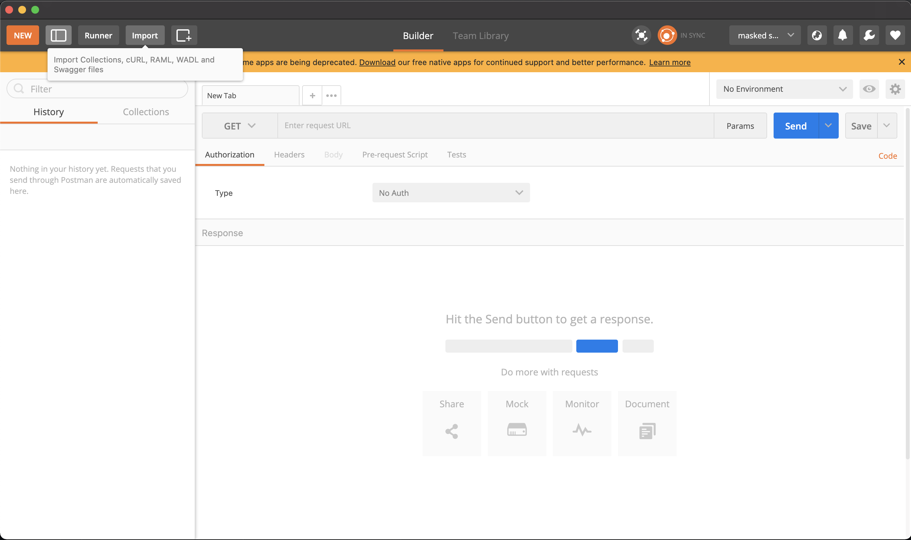
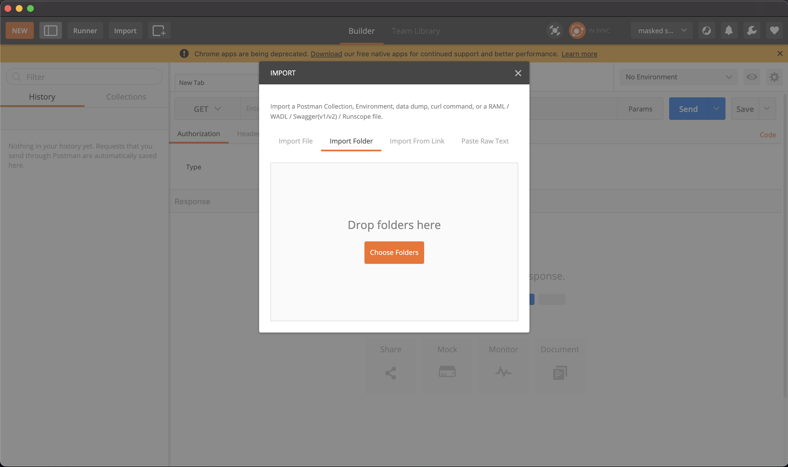
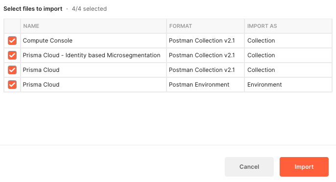
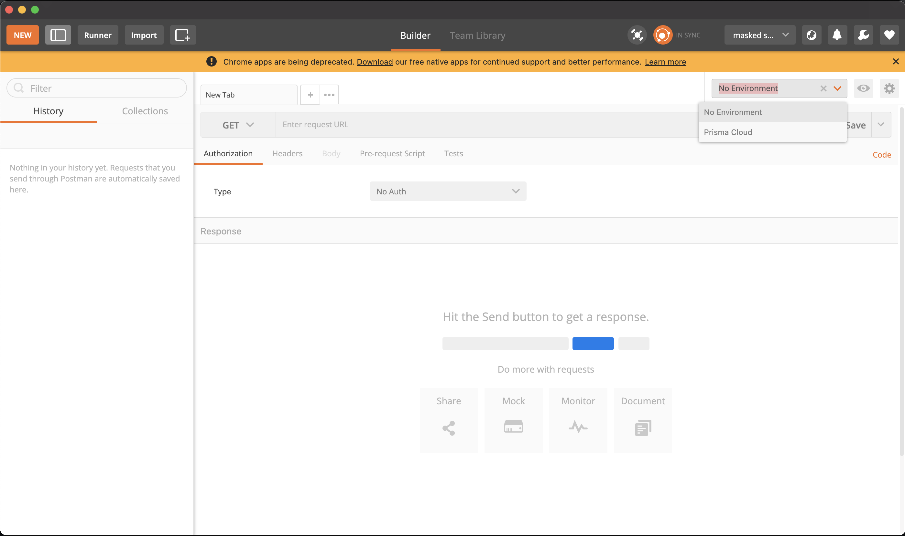
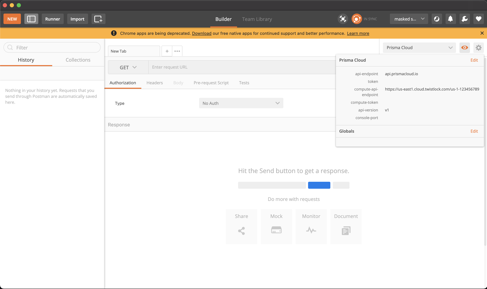

# Instructions

The following paragraphs detail how to setup the manually maintained Postman Collections and required Environment Variables for Prisma Cloud API requests.

## Setup steps
- [Import the 4 files](https://learning.postman.com/docs/getting-started/importing-and-exporting-data/) in root of this repo (3 Collections and 1 Environment) into Postman.
   
   
   

- Set the [Postman Environment variables](https://learning.postman.com/docs/sending-requests/variables/). You will need to set:
   - api-endpoint
   - compute-api-endpoint
   - aporeto-api-endpoint
   - namespace
   - ACCESS_KEY
   - SECRET_KEY

   
   
   
   
   

- Populate the `compute-api-endpoint` environment variable.
  - Go to *Compute > Manage > System > Utilities*, and copy the string under **Path to Console**
  - The URL will look something like:
    `https://us-east1.cloud.twistlock.com/us-1-123456789`
  

- Populate the `aporeto-api-endpoint` environment variable.
  - Click on the key icon at the bottom of any page on _Cloud Network Security_
  - The URL will look something like :
    `https://api.east-01.network.prismacloud.io'
  

- Populate the `api-enpoint` environment variable.
  - The Admin console you see when you log in determines the the API Endpoint.
  - The value that corresponds to your Admin console below should replace the **api-endpoint** variable.

     | Prisma Cloud Admin Console     | `api-endpoint`         |
     |--------------------------------|------------------------|
     | https://app.prismacloud.io     | api.prismacloud.io     | 
     | https://app2.prismacloud.io    | api2.prismacloud.io    | 
     | https://app3.prismacloud.io    | api3.prismacloud.io    | 
     | https://app4.prismacloud.io    | api4.prismacloud.io    | 
     | https://app.anz.prismacloud.io | api.anz.prismacloud.io | 
     | https://app.eu.prismacloud.io  | api.eu.prismacloud.io  | 
     | https://app2.eu.prismacloud.io | api2.eu.prismacloud.io | 
     | https://app.gov.prismacloud.io | api.gov.prismacloud.io | 
     | https://app.prismacloud.cn     | api.prismacloud.cn     | 
     | https://app.ca.prismacloud.io  | api.ca.prismacloud.io  | 
     | https://app.sg.prismacloud.io  | api.sg.prismacloud.io  | 

      *The rest of the variables shouldn't need to be altered, and are either auto-generated or for future or other scenarios*

- A sample populated Environment **before** generating any JWT tokens might look like as follows:

| Postman Variable         | Use                                                                 | Value/Example                                         |
|--------------------------|---------------------------------------------------------------------|-------------------------------------------------------|
| `api-endpoint`           | Main API endpoint for Prisma Cloud requests                         | api.prismacloud.io                                    |
| `token`                  | JWT token auto-generated after the /login request                   |                                                       |
| `compute-api-endpoint`   | API endpoint for all things within the Compute tab                  | `https://us-east1.cloud.twistlock.com/us-1-123456789` |
| `compute-token`          | JWT token auto-generated after the Compute /authenticate request    |                                                       |
| `api-version`            | Used only for the Compute collection for future API versions        | v1                                                    |
| `console-port`           | Used only for self-hosted versions of the Compute Console           |                                                       |
| `aporeto-api-endpoint`   | API endpoint for all things within the Microsegmentation tab        | `https://api.east-01.network.prismacloud.io`          |
| `aporeto-token`          | JWT token auto-generated after the Microsegmentation /issue request |                                                       |
| `namespace`              | The namespace on CNS where you will be operating                    | /859889522116745232/my-cloud-account/Application      |

## Advanced Postman scenarios using Collection Runner

In the **Collection_Runner** folder, there are specific examples for use-cases where using Postman's Collection Runner makes sense. These runners provide an easy way to iterate through files and perform bulk API calls. More instructions can be found in in the README within [this folder](https://github.com/PaloAltoNetworks/pcs-postman/tree/main/Collection_Runner).

**That's it!**

The Collections are not fully complete, so if you find a request that hasn't been created (or needs to be updated) please feel free to submit a PR.

## Notes
### Accessing Multiple Tenants
You can easily switch between Prisma Cloud Tenants by creating multiple Environments. To do this just import the `Prisma Cloud.postman_environment.json` file again and set the new api endpoints and credentials. Be sure to change the environment name so you can tell your environments apart! 
